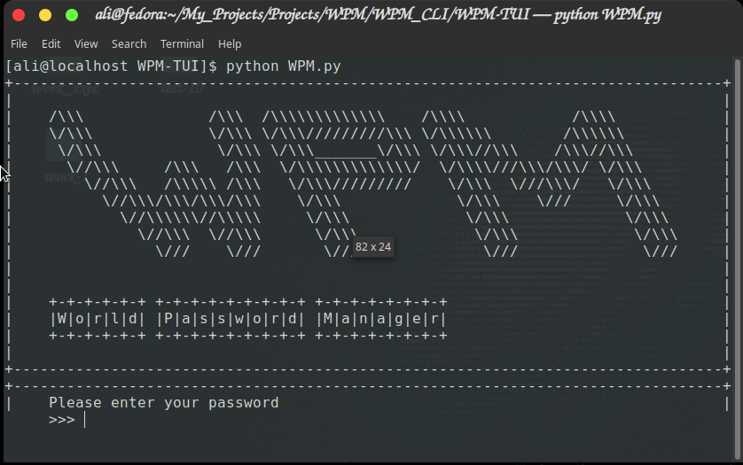
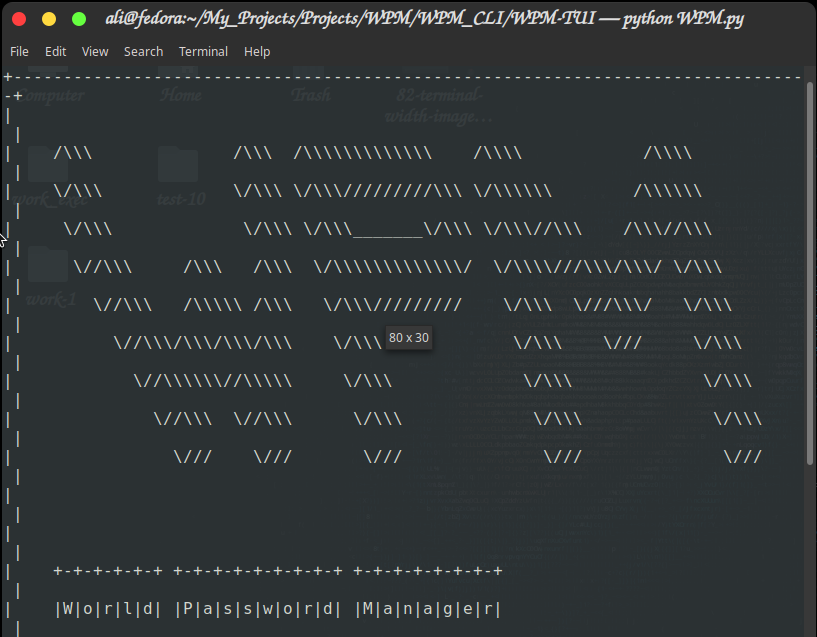
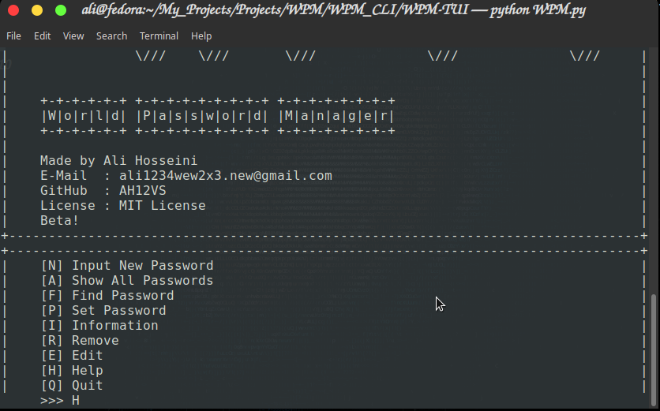
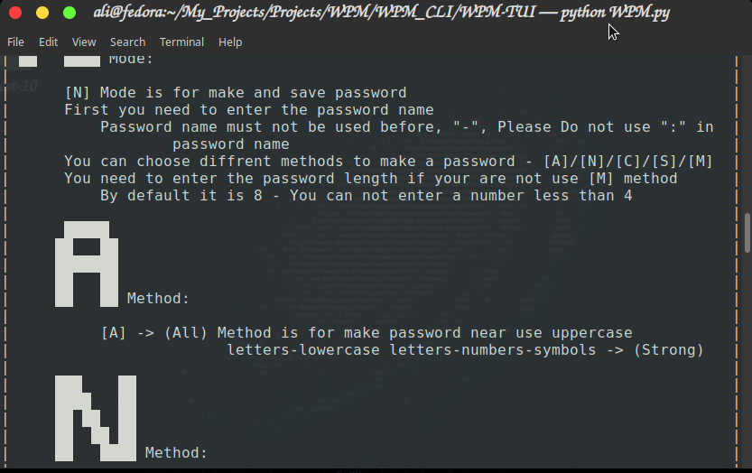

# WPM-TUI
## &emsp; &emsp; World Password Manger - Text-Based User Interface

### WPM-TUI is Beta!
#### &emsp; &emsp; (Well it crash in some where)

### I make WPM in [Linux](https://en.wikipedia.org/wiki/Linux)
#### &emsp; &emsp; So it can not work on another operating system
#### &emsp; &emsp; &emsp; (Of course i will work on that)

### You should use a terminal with width 82

### You can see some help with type \"H\" in program

